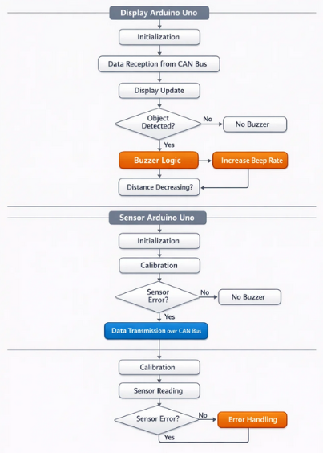
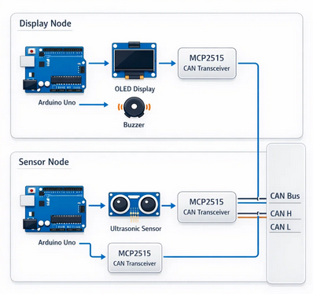

# Reverse Guidance System for Automobiles using CAN Protocol

A distributed embedded reverse parking assistance system built on Arduino Uno, ultrasonic sensing, and CAN-based inter-node communication to provide real-time visual and audible obstacle guidance.

---

## Project Summary

This project implements a low-cost **reverse guidance / parking assistance prototype** for automotive-style embedded systems. The design uses a **dual-node architecture** connected over a **CAN bus**, where one node performs obstacle sensing and the other handles driver feedback.

The system measures rear obstacle distance using **HC-SR04 ultrasonic sensors**, converts the readings into proximity levels, transmits the encoded data over **CAN**, and presents the result through an **OLED display** and **adaptive buzzer alerts**.

Rather than building everything around a single microcontroller, this project was designed as a **distributed embedded system**, making it closer to a real automotive electronics architecture where sensing, communication, and user feedback are often modularized across separate nodes.

---

## What I Built

I designed and implemented a complete working prototype of a reverse parking assistance system with:

- a **Sensor Node** for obstacle detection using ultrasonic sensing
- a **Display Node** for real-time visual and audible guidance
- **CAN-based communication** between both embedded nodes using MCP2515 modules
- **proximity encoding logic** to convert raw distance into compact CAN payloads
- **OLED visualization** for left / center / right obstacle guidance
- **buzzer control logic** with faster alerts as an obstacle gets closer
- full **breadboard hardware integration**, wiring, bring-up, and testing

This project involved both **embedded firmware development** and **hands-on hardware integration**, including sensor connection, CAN communication setup, display interfacing, and prototype validation.

---

## My Contribution

**Author / Developer: Yash Daniel Ingle**

I independently worked on:

- system design and modular node architecture
- Arduino firmware development for both sender and display nodes
- ultrasonic sensor acquisition and calibration logic
- CAN frame encoding / decoding using MCP2515
- OLED and buzzer integration for feedback output
- breadboard prototyping and end-to-end hardware bring-up
- debugging communication, display behavior, and sensor response
- preparing diagrams, flowcharts, and project documentation

---

## Why This Project Matters

This project demonstrates a practical combination of:

- **embedded firmware**
- **sensor integration**
- **CAN communication**
- **real-time feedback systems**
- **automotive-style distributed architecture**
- **hardware bring-up and troubleshooting**

It is a strong example of building a full embedded prototype that spans sensing, communication, processing, and user interaction.

---

## System Architecture

The system is split into two cooperating embedded nodes:

### Sensor Node
The Sensor Node is responsible for:
- reading rear obstacle distance from ultrasonic sensors
- converting measured distances into discrete proximity levels
- packing those levels into a compact CAN payload
- transmitting the encoded information to the Display Node

### Display Node
The Display Node is responsible for:
- receiving CAN messages from the Sensor Node
- decoding the packed proximity values
- updating the OLED display with obstacle guidance
- generating buzzer alerts based on obstacle distance

### High-Level Block Diagram

<p align="center">
  
</p>

---

## Working Principle

The system follows this real-time sequence:

1. The **Sensor Node** reads obstacle distance using ultrasonic sensors.
2. Each sensor reading is mapped into a **proximity level**.
3. The levels are packed into a compact **CAN frame**.
4. The **Display Node** receives and decodes the CAN message.
5. The OLED displays obstacle guidance for left, center, and right zones.
6. The buzzer changes its beep rate depending on proximity.

This architecture keeps sensing, communication, and output cleanly separated and easier to debug, extend, and maintain.

---

## Control Flow

<p align="center">
  
</p>

---

## Tech Stack

### Hardware
- **Arduino Uno** × 2
- **HC-SR04 ultrasonic sensors** × 3
- **MCP2515 CAN controller/transceiver modules** × 2
- **0.96-inch OLED display**
- **Buzzer**
- Breadboards, jumper wires, USB power, CAN interconnect wiring

### Embedded Interfaces
- **CAN bus**
- **SPI** for MCP2515 communication
- **I2C** for OLED interfacing
- **GPIO** for ultrasonic sensing and buzzer control

### Software / Firmware
- **Arduino C/C++**
- **SPI library**
- **MCP2515 library**
- **Wire library**
- **Adafruit_GFX**
- **Adafruit_SSD1306**

---

## Key Features

- **Distributed two-node embedded design**
- **Real-time ultrasonic obstacle sensing**
- **CAN-based communication between nodes**
- **Compact proximity-level encoding**
- **OLED-based visual guidance**
- **Adaptive buzzer alerts**
- **Low-cost prototype implementation**
- **Hands-on hardware integration and testing**
- **Automotive-style system partitioning**

---

## Communication Details

- **Protocol:** CAN (Controller Area Network)
- **Bitrate:** **125 kbps**
- **CAN Interface:** MCP2515-based controller/transceiver modules
- **Transport Strategy:** compact proximity levels packed into CAN payload bytes
- **Physical Layer:** CAN H / CAN L twisted-pair connection with proper termination

Using CAN makes the prototype more representative of real embedded automotive subsystems than a simple direct serial link.

---

## Proximity Encoding Logic

The system does not continuously transmit raw distance values. Instead, each sensor reading is mapped into a small discrete level that represents obstacle closeness.

General interpretation:
- **farther object** → lower urgency
- **closer object** → higher urgency
- **invalid / no useful reading** → no active alert

These levels are packed into a compact CAN payload before transmission.  
This approach:
- reduces data size
- simplifies decoding
- keeps the display and buzzer behavior intuitive
- makes the communication efficient for embedded systems

---

## Repository Structure

```text
arduino-reverse-guidance-system/
├── README.md
├── Arduino_Code/
│   ├── sender_code/
│   │   └── sender.ino
│   └── display_code/
│       └── display.ino
└── Images/
    ├── img1.png
    ├── img2.png
    ├── img3.jpeg
    ├── img4.jpeg
    ├── img5.jpeg
    └── img6.png
